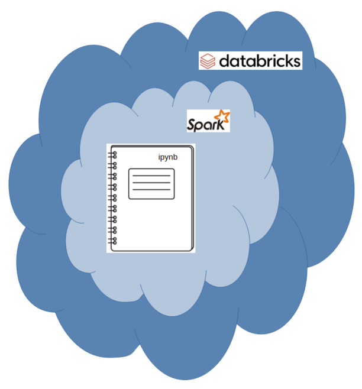

# Ingestion and Preprocessing of big batches of Flight Data using Spark on Databricks

## Overview
This project utilizes an [iPython notebook](./Preparing%20Flights%20Big%20Data.ipynb) within the Databricks platform to process flight big data using the PySpark framework.
The dataset is ingested from the [Harvard Dataverse API](https://dataverse.harvard.edu/api) in CSV format, and is preprocessed by defining the schema and employing the six dimensions of data quality to check and clean the data.
The cleaned and verified dataset is then saved into a Parquet file.

## Architectural Diagram

## Project Workflow
1. **Ingest Data**: Fetch flight data from [Harvard Dataverse API](https://dataverse.harvard.edu/api) in CSV format.
2. **Define Schema**: Declare the schema for the flight data.
3. **Data Quality Checks**: Apply the six dimensions of data quality:
   - Completeness
   - Consistency
   - Accuracy
   - Validity
   - Uniqueness
   - Timeliness
4. **Data Cleaning**: Clean the data based on the defined dimensions.
5. **Save Cleaned Data**: Save the checked and cleaned dataset as a Parquet file.

## Dependencies
To run this project, ensure you have the following dependencies:
- Databricks account
- PySpark

## Acknowledgements
- [Harvard Dataverse](https://dataverse.harvard.edu) for providing the dataset.